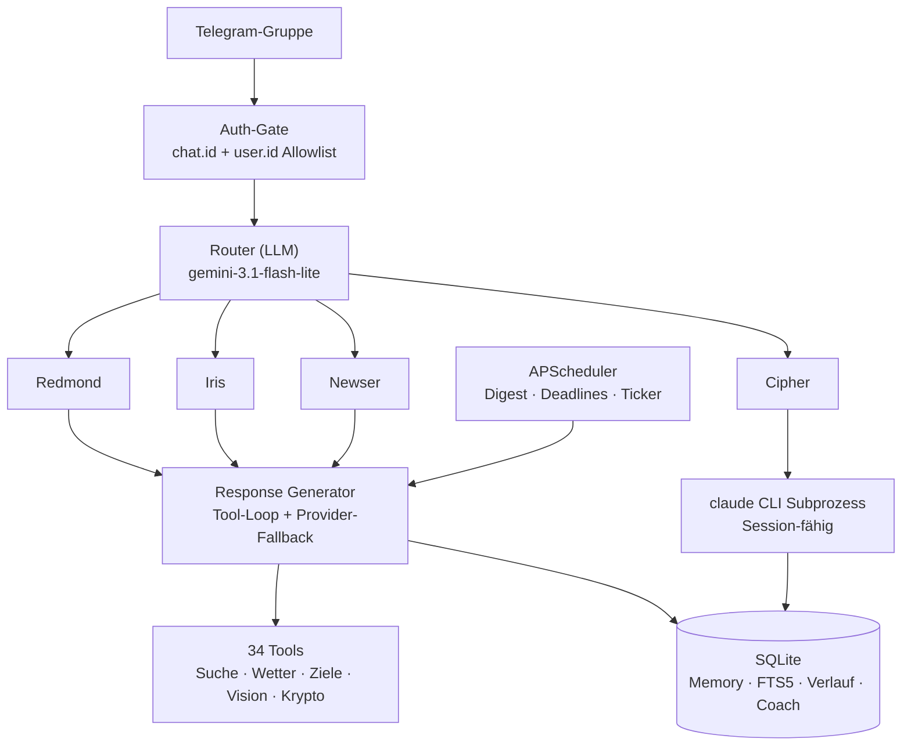

# Redmond Cloud

**Vier Telegram-Bots. Ein Python-Prozess. Ein Gruppenchat.**

Ein Multi-Agenten-Assistenz-Hub, der rund um die Uhr auf einer Oracle Cloud Free Tier VM
läuft. Jeder Bot ist ein eigenständiger Agent mit eigener Persönlichkeit, eigenem Toolset und
eigener Modellkonfiguration — sie teilen sich jedoch eine Event-Loop, eine SQLite-Datenbank
und einen gemeinsamen Gesprächsverlauf und können Aufgaben mitten im Dialog aneinander
übergeben.


🇬🇧 [English version](README.md) · 📐 [Architektur](docs/ARCHITECTURE.md)

---

## Die Agenten

| Bot | Rolle | Aufgabe |
|---|---|---|
| 🦞 **Redmond** | Listener + Router | Liest jede Nachricht, entscheidet, welcher Agent antwortet, übernimmt allgemeine Anfragen |
| 🎯 **Iris** | Coach & Tracker | Ziele, Deadlines, Tagebuch, Mahlzeiten, Schichten — mit proaktiven Check-ins statt bloßer Antworten |
| 📰 **Newser** | Recherche | Websuche und Nachrichten mit Quellen-Ranking, personalisierte Digests |
| 🧠 **Cipher** | Ops | Kapselt die Claude-Code-CLI als Subprozess, damit der Server aus dem Chat heraus inspizierbar ist |

Alle vier laufen in einem einzigen `asyncio.gather` — vier `Application`-Instanzen, die sich
Dispatcher, Coordinator und Datenbank teilen. Der Privacy-Modus ist deaktiviert, jeder Bot
sieht also jede Nachricht; der Router entscheidet, wer sprechen darf.

## Architektur



## Technische Kernpunkte

Die Stellen, die tatsächlich schwierig waren — und wie sie gelöst wurden:

**Modellausfälle sind der Normalfall, nicht die Ausnahme.** Free-Tier-LLM-Endpunkte
verschwinden ohne Vorwarnung — Groq entfernte `qwen3-32b` im laufenden Betrieb, und jeder
Fallback lieferte nur noch ein nacktes 404. Der Response Generator arbeitet daher eine Kette
ab: Primärmodell → Fallback-Modell → anderer Anbieter (Groq → Gemini). Fehler der einzelnen
Stufen werden protokolliert statt überschrieben, sodass die Fehlermeldung beim Nutzer die
tatsächliche Ursache nennt.

**Ein Router, der auch „niemand“ entscheiden kann.** Naives Routing führt dazu, dass jeder
Bot auf jede Nachricht antwortet. Der Router ist ein separater Aufruf eines günstigen
Modells: Er liefert explizit das Ergebnis „niemand soll antworten“, wertet Reply-Ketten als
Kontext aus und erkennt, dass die Erwähnung der eigenen Infrastruktur eine Fehlermeldung ist
und keine Nachrichtenanfrage.

**JSON-Dateien skalierten nicht mehr, daher der Umzug nach SQLite.** Ziele, Tagebuch,
Deadlines, Chatverlauf und Langzeitgedächtnis lagen in flachen JSON-Dateien. Sie liegen
jetzt in einer SQLite-Datenbank mit Schema-Migrationspfad, FTS5-Volltextsuche über das
Gedächtnis und einem Verlauf, der Neustarts übersteht. Die Altdaten bleiben lesbar — die
Migration ist durch eigene Kompatibilitätstests abgesichert.

**Tests dürfen die Produktivdatenbank nie berühren.** Die Suite läuft pro Test gegen eine
isolierte temporäre Datenbank, Verbindungen werden explizit geschlossen — unter Windows
blockiert ein offenes Handle das Aufräumen stillschweigend und macht aus einem Fehlschlag
eine ganze Kaskade.

**Das Token-Budget ist eine Design-Vorgabe.** Free-Tier-Kontingente sind knapp: System-Prompts
sind aufgeteilt (englischer Kern zur Token-Ersparnis, lokalisierte Voice-Schicht), das Dossier
wird abschnittsweise statt vollständig gelesen, Tools werden vor dem Request gefiltert, und
der Cache pro Konversation wird wiederverwendet.

## Stack

Python 3.12 · `python-telegram-bot` · Groq · Google Gemini · SQLite (FTS5) · APScheduler ·
Pydantic · pytest · systemd · Oracle Cloud Free Tier

**Über 14.000 Zeilen Python · 371 Tests · 60 Commits · seit Mai 2026 im Produktivbetrieb**

## Tests

```bash
python -m pytest tests/ -q
```

371 Tests, ohne Netzwerkzugriff — externe Aufrufe werden auf Fixture-Ebene gestubbt. Die CI
führt die vollständige Suite bei jedem Push aus.

## Lokal starten

```bash
python -m venv .venv
.venv/Scripts/activate          # Windows
pip install -r requirements.txt

cp .env.example .env            # Bot-Tokens und API-Keys eintragen
python cloud_main_v2.py
```

Benötigt werden vier Telegram-Bot-Tokens (via [@BotFather](https://t.me/BotFather)), ein
Groq-API-Key und ein Gemini-API-Key. Die gesamte Konfiguration wird aus Umgebungsvariablen
mit dem Präfix `REDMOND_` gelesen — siehe [`.env.example`](.env.example).

## Deployment

Der Code wird per `git pull` ausgeliefert; Laufzeitzustand landet nie im Repository.

```bash
ssh ubuntu@deine-vm "cd ~/redmond-hub && git pull && sudo systemctl restart redmond-hub.service"
```

Der Hub läuft als systemd-Unit (Autostart nach Reboot). Die Datenbank wird nächtlich um 04:30
per `VACUUM INTO` gesichert, 14 rollierende Snapshots werden vorgehalten. Secrets (`.env`),
Laufzeitdaten (`data/`) und das Owner-Profil sind gitignored und existieren nur auf der
Maschine.

## Projektstruktur

```
cloud_main_v2.py        Einstiegspunkt
config/                 Pydantic-Settings, JSON-Schema, Personality-Profil
core/                   Dispatcher, Coordinator, Multi-Bot-Runner, Scheduler
handlers/               Telegram-Handler und Auth-Gate
logic/                  Agenten, Router, Response Generator, Tools, Vision, Digest
utils/                  SQLite-Layer, Gemini-Client, Memory, Suche, Migrationen
safety/                 Goal Manager
deploy/                 systemd-Unit, Backup-Skript
tests/                  371 Tests
```

## Lizenz

MIT — siehe [LICENSE](LICENSE).
