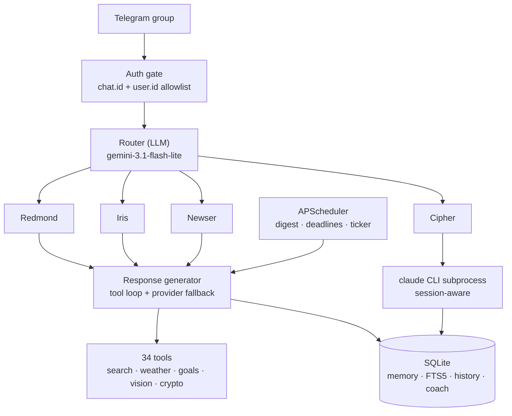

# Redmond Cloud

**Four Telegram bots. One Python process. One group chat.**

A multi-agent assistant hub running 24/7 on an Oracle Cloud Free Tier VM. Each bot is a
distinct agent with its own personality, tool set and model configuration — but they share
one event loop, one SQLite database and one conversation history, so they can hand work to
each other mid-dialogue.


🇩🇪 [Deutsche Version](README.de.md) · 📐 [Architecture](docs/ARCHITECTURE.md)

---

## The agents

| Bot | Role | What it actually does |
|---|---|---|
| 🦞 **Redmond** | Listener + router | Reads every message, decides which agent should answer, handles general requests |
| 🎯 **Iris** | Coach & tracker | Goals, deadlines, diary, meals, work shifts — with proactive check-ins, not just replies |
| 📰 **Newser** | Research | Web search and news with source ranking, personalised digests |
| 🧠 **Cipher** | Ops | Wraps the Claude Code CLI as a subprocess so the server can be inspected from the chat |

All four run inside a single `asyncio.gather` — four `Application` instances sharing a
dispatcher, a coordinator and the database. Privacy mode is off, so every bot sees every
message; the router decides who is allowed to speak.

## Architecture



## Engineering notes

The parts that were actually hard, and how they were solved:

**Model outages are the normal case, not the exception.** Free-tier LLM endpoints disappear
without warning — Groq removed `qwen3-32b` mid-flight and every fallback returned a bare 404.
The response generator now walks a chain: primary model → fallback model → a different
provider entirely (Groq → Gemini), with the failure of each step recorded rather than
overwritten, so the last error the user sees is the real one.

**A router that can decide "nobody".** Naive routing makes every bot answer every message.
The router is a separate cheap-model call that returns an explicit "no one should reply"
outcome, reads reply-chains for context, and recognises that a mention of the project's own
infrastructure is a bug report, not a news request.

**JSON files stopped scaling, so the storage moved to SQLite.** Goals, diary, deadlines,
chat history and long-term memory were flat JSON. They now live in one SQLite database with
a schema-migration path, FTS5 full-text search over memory, and history that survives a
restart. The legacy JSON files are still readable — the migration is covered by dedicated
compatibility tests.

**Tests must never touch the production database.** The suite runs against an isolated
temporary database per test, with connections explicitly closed — on Windows an open handle
silently blocks cleanup and turns one failure into a cascade of them.

**Token budget is a design constraint.** Free-tier quotas are small, so system prompts are
split (English core for token economy, localised voice layer), the dossier is read by section
instead of whole, tools are filtered before the request is sent, and the per-conversation
cache is reused.

## Stack

Python 3.12 · `python-telegram-bot` · Groq · Google Gemini · SQLite (FTS5) · APScheduler ·
Pydantic · pytest · systemd · Oracle Cloud Free Tier

**14,000+ lines of Python · 371 tests · 60 commits · running in production since May 2026**

## Tests

```bash
python -m pytest tests/ -q
```

371 tests, no network access required — external calls are stubbed at the fixture level.
CI runs the full suite on every push.

## Running it locally

```bash
python -m venv .venv
.venv/Scripts/activate          # Windows
pip install -r requirements-cloud.txt

cp .env.example .env            # fill in bot tokens and API keys
python cloud_main_v2.py
```

You will need four Telegram bot tokens (from [@BotFather](https://t.me/BotFather)), a Groq
API key and a Gemini API key. All configuration is read from environment variables with a
`REDMOND_` prefix — see [`.env.example`](.env.example).

## Deployment

Code ships through `git pull`; runtime state never enters the repository.

```bash
ssh ubuntu@your-vm "cd ~/redmond-hub && git pull && sudo systemctl restart redmond-hub.service"
```

The hub runs as a systemd unit (auto-restart on boot). The database is backed up nightly at
04:30 via `VACUUM INTO`, keeping 14 rolling snapshots. Secrets (`.env`), runtime data
(`data/`) and the owner profile are gitignored and live only on the machine.

## Project layout

```
cloud_main_v2.py        entry point
config/                 pydantic settings, JSON schema, personality profile
core/                   dispatcher, coordinator, multi-bot runner, scheduler
handlers/               Telegram handlers and the auth gate
logic/                  agents, router, response generator, tools, vision, digest
utils/                  SQLite layer, Gemini client, memory, search, migrations
safety/                 goal manager
deploy/                 systemd unit, backup script
tests/                  371 tests
```

## License

MIT — see [LICENSE](LICENSE).
